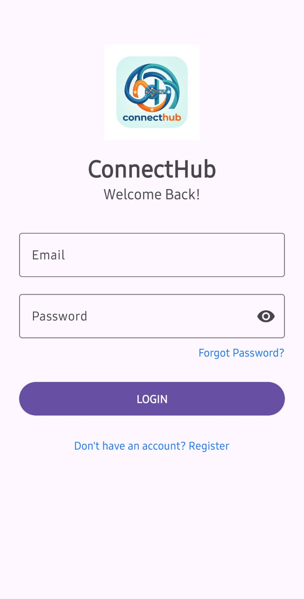
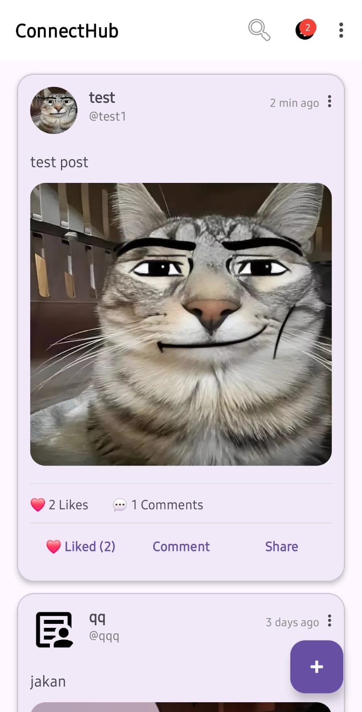
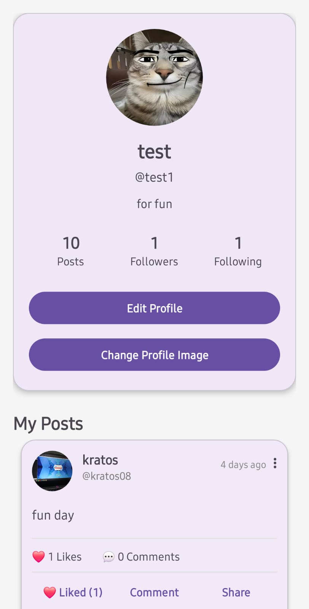
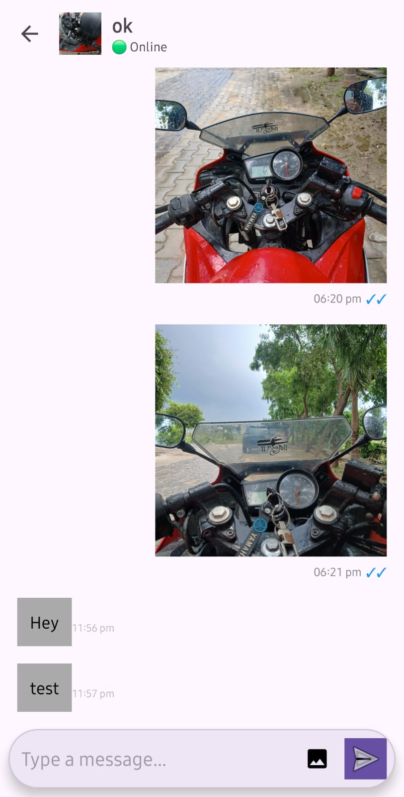
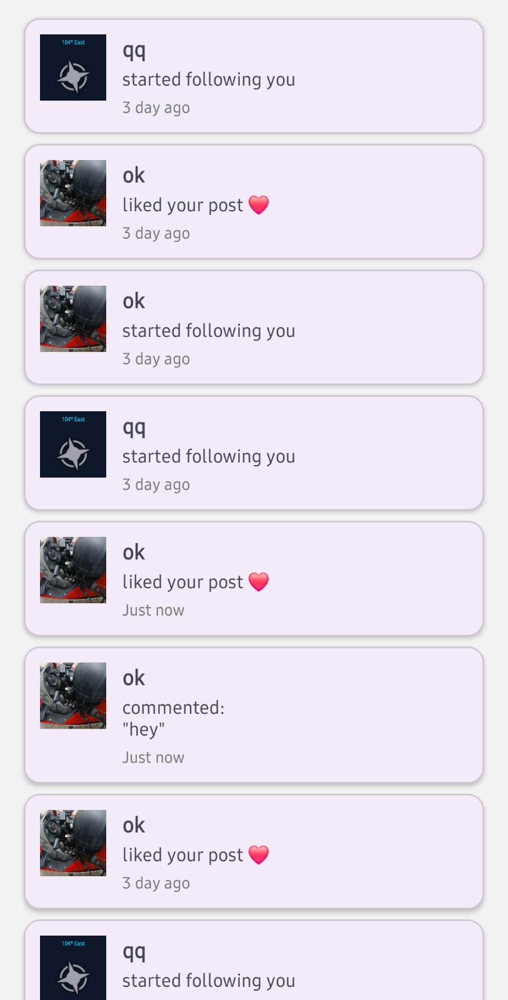
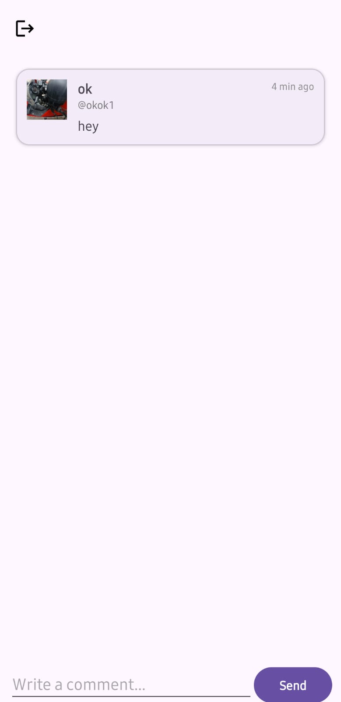

# 📱 ConnectHub

<p align="center">
  <b>A modern Android social media application built with Java, Firebase & Cloudinary.</b>
</p>

<p align="center">
  Connect • Share • Chat • Discover
</p>

---

## ✨ Overview

ConnectHub is a feature-rich Android social networking application that allows users to connect with others, create posts, chat in real time, and interact through likes, comments, and notifications.

The project is built using modern Android development practices with Firebase as the backend and Cloudinary for image storage.

---

## 📸 Screenshots

| Login | Home Feed | Profile |
|-------|-----------|----------|
|  |  |  |

| Chat | Notifications | Comments |
|------|---------------|-----------|
|  |  |  |

# 🚀 Features

## 👤 Authentication

- User Registration
- User Login
- Auto Login
- Secure Logout
- Firebase Authentication

---

## 🏠 Home Feed

- Create Posts
- View Posts
- Like Posts
- Comment on Posts
- Share Posts
- Real-time Feed Updates

---

## 👤 User Profile

- Edit Profile
- Upload Profile Picture
- Bio
- Profile Information
- View User Posts

---

## 💬 Real-Time Chat

- One-to-One Chat
- Real-time Messaging
- Image Messages
- Online / Offline Status
- Last Seen
- Typing Indicator
- Read Receipts (✓ ✓ Seen)

---

## ❤️ Social Features

- Follow Users
- Like System
- Comments
- Notifications

---

# 🛠 Tech Stack

| Technology | Usage |
|------------|-------|
| Java | Android Development |
| Firebase Authentication | User Authentication |
| Cloud Firestore | Database |
| Cloudinary | Image Storage |
| Glide | Image Loading |
| Material Design 3 | UI Design |
| RecyclerView | Dynamic Lists |

---

# 📂 Project Structure

```
app
│
├── activities
├── adapters
├── firebase
├── helpers
├── models
├── network
├── repository
├── services
└── utils
```

---

# 🏗 Architecture

```
UI (Activities)
        │
        ▼
Repository Layer
        │
        ▼
Firebase Firestore
        │
        ▼
Cloudinary (Images)
```

---

# 🔥 Current Features

- ✅ Firebase Authentication
- ✅ User Profiles
- ✅ Edit Profile
- ✅ Create Posts
- ✅ Like System
- ✅ Comment System
- ✅ Search Users
- ✅ Chat List
- ✅ Real-time Chat
- ✅ Image Messages
- ✅ Online Status
- ✅ Typing Indicator
- ✅ Last Seen
- ✅ Read Receipts

---

# 🚧 Upcoming Features

- Delete Messages
- Edit Messages
- Full Screen Image Viewer
- Push Notifications
- Voice Messages
- Group Chat
- Stories
- Video Sharing
- Dark Mode
- Message Reactions
- Post Saving
- User Blocking

---

# ⚙️ Installation

Clone the repository

```bash
git clone https://github.com/Indra9555/ConnectHub.git
```

Open the project in Android Studio.

Add your own Firebase configuration file:

```
app/google-services.json
```

Sync Gradle.

Run the application.

---

# 📖 Learning Objectives

This project was created to improve skills in:

- Android Development
- Java
- Firebase
- Cloud Firestore
- REST APIs
- Image Uploading
- Real-time Applications
- Material Design
- Git & GitHub

---

# 🤝 Contributing

Contributions, suggestions and feedback are always welcome.

Feel free to fork the repository and submit a Pull Request.

---

# 📄 License

This project is developed for educational and portfolio purposes.

---

# 👨‍💻 Developer

**Indrajeet Verma**

B.Tech Computer Science Student

Android Developer | Java | Firebase | Cloud Computing

GitHub:
https://github.com/Indra9555

---

<p align="center">
⭐ If you like this project, consider giving it a star!
</p>
