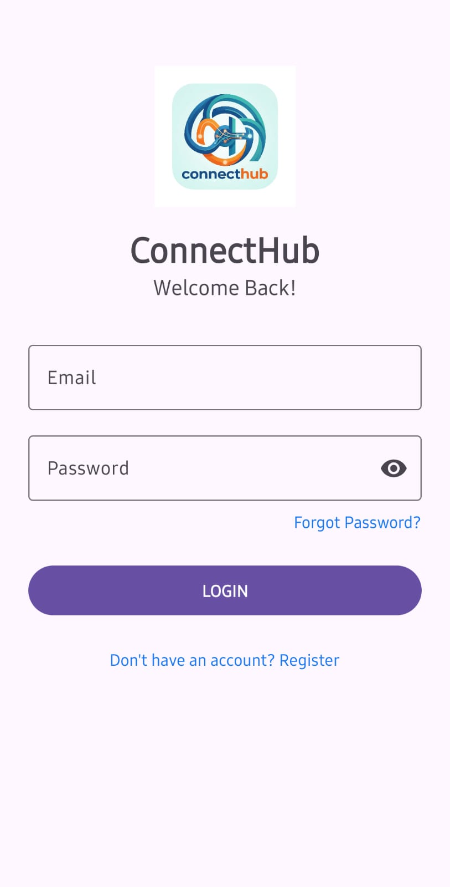
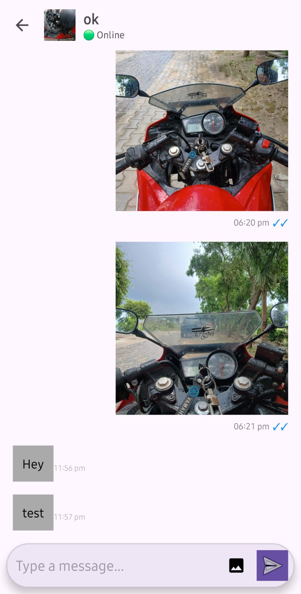
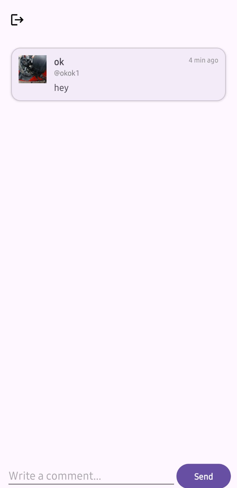

# 📱 ConnectHub

<p align="center">
  <b>A modern Android social media & real-time messaging application built with Java, Firebase & Cloudinary.</b>
</p>

<p align="center">
Connect • Share • Chat • Discover
</p>

---

# ✨ Overview

ConnectHub is a full-featured Android social networking application that enables users to connect, share posts, chat in real time, and interact with a modern messaging experience.

The application is built completely in **Java** using **Firebase** for backend services and **Cloudinary** for media storage, following clean architecture and modern Android development practices.

---

# 📸 Screenshots

| Login | Home Feed | Profile |
|-------|-----------|----------|
|  |  |  |

| Chat | Notifications | Comments |
|------|---------------|-----------|
|  |  |  |

---

# 🚀 Features

## 👤 Authentication

- Firebase Authentication
- Secure Login & Registration
- Auto Login
- Secure Logout

---

## 🏠 Home Feed

- Create Posts
- Image Posts
- Like Posts
- Comment System
- Real-time Feed Updates
- User Search
- Share-ready Architecture

---

## 👤 User Profile

- Edit Profile
- Upload Profile Picture
- Bio & Personal Information
- View User Posts
- Cloudinary Image Upload

---

## 💬 Real-Time Chat

### Messaging

- One-to-One Chat
- Real-time Messaging
- Text Messages
- Image Messages
- Voice Messages
- Read Receipts (✓ ✓)
- Online / Offline Status
- Last Seen
- Typing Indicator

### Voice Messages

- Hold to Record
- Slide to Cancel
- Recording Timer
- Waveform Visualization
- Seekable Voice Playback
- Pause / Resume
- Playback Speed Control (1× / 1.5× / 2×)

### Chat Experience

- Swipe to Reply
- Reply Preview
- Double Tap ❤️ Reaction
- Emoji Reactions
- Long Press Context Menu
- Copy Message
- Delete for Everyone
- Full Screen Image Viewer
- Smooth Animations

---

## ❤️ Social Features

- Follow Users
- Like System
- Comment System
- Notifications
- Search Users

---

# 🛠 Tech Stack

| Technology | Purpose |
|------------|---------|
| Java | Android Development |
| Firebase Authentication | User Authentication |
| Cloud Firestore | Realtime Database |
| Cloudinary | Image Storage |
| Glide | Image Loading |
| RecyclerView | Dynamic UI |
| Material Design 3 | UI Components |
| MediaRecorder | Voice Recording |
| MediaPlayer | Voice Playback |
| WaveformSeekBar | Voice Waveform |

---

# 📂 Project Structure

```
app
│
├── activities
├── adapters
├── firebase
├── helpers
├── models
├── network
├── repository
├── services
├── utils
└── listeners
```

---

# 🏗 Architecture

```
Activities
      │
      ▼
Repository Layer
      │
      ▼
Firebase Firestore
      │
      ├──────────────► Firebase Authentication
      │
      └──────────────► Cloudinary
```

---

# ✅ Implemented Features

- ✅ Firebase Authentication
- ✅ User Profiles
- ✅ Edit Profile
- ✅ Create Posts
- ✅ Like System
- ✅ Comment System
- ✅ Search Users
- ✅ Chat List
- ✅ One-to-One Chat
- ✅ Real-time Messaging
- ✅ Image Messages
- ✅ Voice Messages
- ✅ Waveform Playback
- ✅ Voice Recording
- ✅ Reply Messages
- ✅ Swipe to Reply
- ✅ Emoji Reactions
- ✅ Online Status
- ✅ Last Seen
- ✅ Typing Indicator
- ✅ Read Receipts
- ✅ Delete for Everyone
- ✅ Full Screen Image Viewer
- ✅ Smooth Chat Animations

---

# 🚧 Upcoming Features

- Delete for Me
- Edit Messages
- Group Chat
- Push Notifications (FCM)
- Stories
- Video Messages
- Voice Calls
- Video Calls
- Dark Mode
- Message Search
- Starred Messages
- Pinned Messages
- Chat Wallpaper
- User Blocking
- End-to-End Encryption

---

# ⚙️ Installation

Clone the repository

```bash
git clone https://github.com/Indra9555/ConnectHub.git
```

Open the project in Android Studio.

Add your Firebase configuration file:

```
app/google-services.json
```

Configure your Cloudinary credentials.

Sync Gradle.

Run the application.

---

# 📖 Learning Outcomes

This project helped strengthen my understanding of:

- Android Development (Java)
- Firebase Authentication
- Cloud Firestore
- Cloudinary Integration
- Realtime Database
- Media Recording & Playback
- RecyclerView
- Material Design
- Repository Pattern
- Clean Code Practices
- Git & GitHub

---

# 🤝 Contributing

Contributions, suggestions and feedback are always welcome.

Feel free to fork the repository and submit a Pull Request.

---

# 📄 License

This project is developed for learning, portfolio, and educational purposes.

---

# 👨‍💻 Developer

**Indrajeet Verma**

B.Tech Computer Science Student

Android Developer • Java • Firebase • Cloud Computing

GitHub:
https://github.com/Indra9555

---

<p align="center">
⭐ If you like this project, consider giving it a star!
</p>
