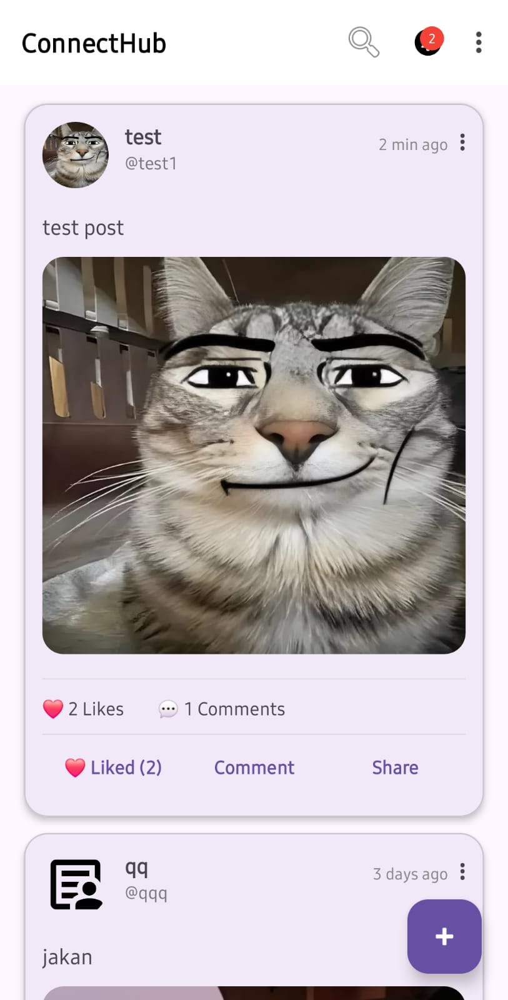
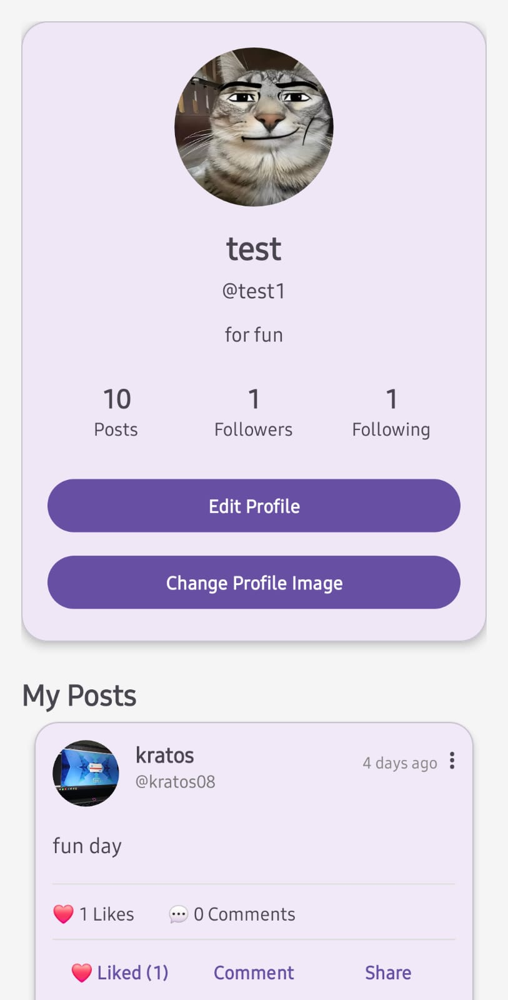
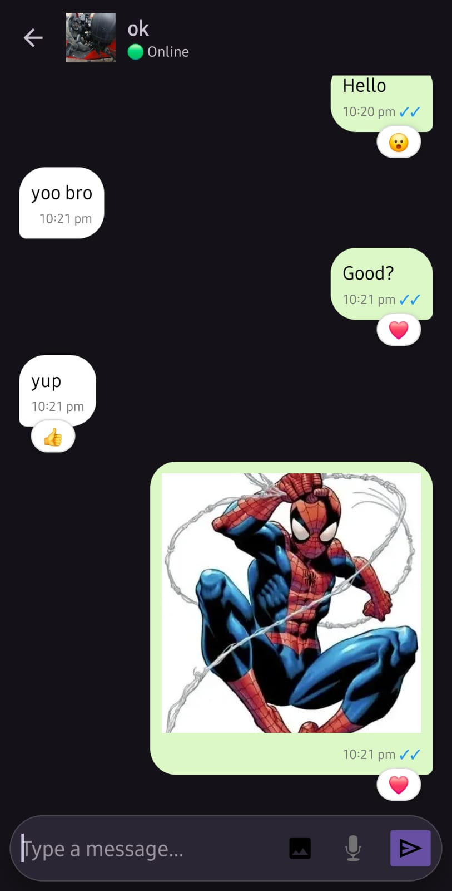
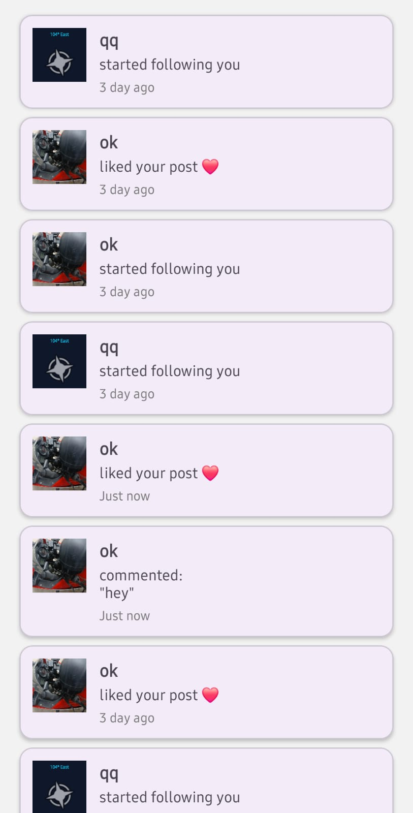

# 📱 ConnectHub

<p align="center">

# A Modern Social Media & Real-Time Chat Application for Android

Built with **Java**, **Firebase**, **Cloudinary**, and **Material Design 3**

<br>


<br>


</p>

---

# ⭐ Enjoying ConnectHub?

If you like this project, consider giving it a **⭐ Star** on GitHub.

It helps the project reach more developers and motivates future development.

---

# 📑 Quick Navigation

- [✨ Overview](#-overview)
- [🎥 Demo](#-demo)
- [📸 Screenshots](#-screenshots)
- [🚀 Features](#-features)
- [🛠 Tech Stack](#-tech-stack)
- [📂 Project Structure](#-project-structure)
- [🏗 Architecture](#-architecture)
- [✅ Implemented Features](#-implemented-features)
- [🚧 Upcoming Features](#-upcoming-features)
- [⚙️ Installation](#️-installation)
- [📖 Learning Outcomes](#-learning-outcomes)
- [🤝 Contributing](#-contributing)
- [👨‍💻 Developer](#-developer)

---

# ✨ Overview

ConnectHub is a modern Android social networking application designed to provide a complete social media experience with **real-time messaging**, **post sharing**, and **interactive communication**.

The project follows modern Android development practices while using Firebase for backend services and Cloudinary for media storage.

## Highlights

- 📱 Native Android Application
- 💬 Real-Time Chat
- 🎤 Voice Messaging
- 📷 Image Sharing
- ❤️ Emoji Reactions
- 👤 User Profiles
- ☁ Firebase Backend
- ⚡ Clean Architecture

---

# 🎥 Demo

<p align="center">


</p>

---

# 📸 Screenshots

| Login | Home Feed | Profile |
|:------:|:---------:|:--------:|
|  |  |  |

| Chat | Notifications | Comments |
|:------:|:-------------:|:----------:|
|  |  |  |

---

# 🚀 Features

## 👤 Authentication

- Firebase Authentication
- Secure Registration
- Login
- Auto Login
- Secure Logout

---

## 🏠 Home Feed

- Create Posts
- Image Posts
- Like Posts
- Comment System
- Real-Time Feed Updates
- Search Users

---

## 👤 User Profile

- Edit Profile
- Upload Profile Picture
- Bio
- User Information
- User Posts

---

## 💬 Real-Time Chat

### Messaging

- One-to-One Chat
- Real-Time Messaging
- Text Messages
- Image Messages
- Voice Messages
- Read Receipts
- Typing Indicator
- Online / Offline Status
- Last Seen

### Voice Messages

- Hold to Record
- Slide to Cancel
- Recording Timer
- Waveform Visualization
- Seekable Playback
- Pause / Resume
- Playback Speed (1× • 1.5× • 2×)

### Interactive Chat

- Swipe to Reply
- Reply Preview
- Emoji Reactions
- Double Tap ❤️ Reaction
- Long Press Context Menu
- Copy Message
- Delete for Everyone
- Full Screen Image Viewer
- Smooth Animations

---

## ❤️ Social Features

- Like System
- Comment System
- Follow Users
- Notifications
- User Search

---

# 🛠 Tech Stack

| Technology | Purpose |
|------------|----------|
| Java | Android Development |
| Firebase Authentication | User Authentication |
| Cloud Firestore | Real-Time Database |
| Cloudinary | Media Storage |
| Glide | Image Loading |
| RecyclerView | Dynamic Lists |
| Material Design 3 | UI Components |
| MediaRecorder | Voice Recording |
| MediaPlayer | Voice Playback |
| WaveformSeekBar | Voice Waveform |

---

# 📂 Project Structure

```
app
│
├── activities
├── adapters
├── firebase
├── helpers
├── listeners
├── models
├── network
├── repository
├── services
└── utils
```

---

# 🏗 Architecture

```
               Android Activities
                       │
                       ▼
              Repository Layer
                       │
        ┌──────────────┼──────────────┐
        ▼              ▼              ▼
 Authentication   Cloud Firestore   Cloudinary
        │              │              │
        └──────────────┴──────────────┘
                 Real-Time Backend
```

---

# ✅ Implemented Features

- ✅ Firebase Authentication
- ✅ User Profiles
- ✅ Edit Profile
- ✅ Create Posts
- ✅ Like System
- ✅ Comment System
- ✅ Search Users
- ✅ Chat List
- ✅ One-to-One Chat
- ✅ Real-Time Messaging
- ✅ Image Messages
- ✅ Voice Messages
- ✅ Voice Recording
- ✅ Waveform Playback
- ✅ Playback Speed Control
- ✅ Swipe to Reply
- ✅ Reply Preview
- ✅ Emoji Reactions
- ✅ Double Tap Reactions
- ✅ Delete for Everyone
- ✅ Full Screen Image Viewer
- ✅ Online Status
- ✅ Typing Indicator
- ✅ Last Seen
- ✅ Read Receipts
- ✅ Smooth Chat Animations

---

# 🚧 Upcoming Features

- Delete for Me
- Edit Messages
- Group Chat
- Push Notifications (FCM)
- Stories
- Video Messages
- Voice Calls
- Video Calls
- Dark Mode
- Message Search
- Starred Messages
- Chat Wallpaper
- User Blocking
- End-to-End Encryption

---

# ⚙️ Installation

Clone the repository

```bash
git clone https://github.com/Indra9555/ConnectHub.git
```

Open the project in Android Studio.

Add your Firebase configuration:

```
app/google-services.json
```

Configure Cloudinary credentials.

Sync Gradle.

Run the application.

---

# 📖 Learning Outcomes

This project helped strengthen my understanding of:

- Android Development (Java)
- Firebase Authentication
- Cloud Firestore
- Cloudinary Integration
- Real-Time Applications
- Media Recording & Playback
- RecyclerView
- Material Design 3
- Repository Pattern
- Clean Architecture
- Git & GitHub

---

# 🤝 Contributing

Contributions, ideas, and feedback are always welcome.

Feel free to fork this repository and submit a Pull Request.

---

# 📄 License

This project is developed for learning, portfolio, and educational purposes.

---

# 👨‍💻 Developer

## Indrajeet Verma

**B.Tech Computer Science Student**

Android Developer • Java • Firebase • Cloud Computing

GitHub: **https://github.com/Indra9555**

---

<p align="center">

⭐ **If you found this project useful, don't forget to star the repository!** ⭐

</p>
